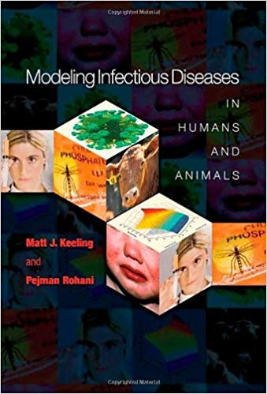

---
title:
output:
  revealjs::revealjs_presentation:
    theme: simple
    css: styles.css
    self_contained: false
    mathjax: local
    #reveal_plugins: ["zoom","chalkboard"]
always_allow_html: yes
---

```{r setup, include=FALSE}
knitr::opts_chunk$set(echo = FALSE)
knitr::opts_chunk$set(fig.align='center')
knitr::opts_chunk$set(fig.width=7)
knitr::opts_chunk$set(fig.height=5)
knitr::opts_chunk$set(out.extra='border:0px;')
suppressPackageStartupMessages(library(ggplot2))
```

## {data-background=#d3d3d3}

<h2 style="color:#0047AB">Introduction to Epirecipes</h2>
<h2 style="color:#000000">Simon Frost</h2>
<h4 style="color:#000000">Professor @Cambridge_Uni</h4>
<h4 style="color:#000000">Turing Fellow @turinginst</h4>
<br>


## Acknowledgements

- Cambridge
    - Dr. Allyson Walsh
    - Dr. Lydia Drumright
    - Prof. James Wood
- ATI
    - Jade Thompson

## Sponsors

<div class="left">

<center>

<br>

<br>

<br>

</center>
</div>
<div class="right">
<center>

<br>

<br>

</center>
</div>

## Introduction

- Mathematical models of infectious disease transmission are widely used in research, policy-making etc.
- Field is becoming increasing computational
    - Simple to complex models
    - Analytical to simulation
    - Deterministic to stochastic
- Relatively inexpensive
    - Well suited for junior researchers
    - Allows contributions from resource-limited settings
- Need capacity building and skill development

## Current problems

- Efforts to increase capacity in disease modeling fall short
    - Focus on the same, basic building blocks
- Models are often not 'open'
    - Model building process is hidden
    - Details and/or implementation may not be available
    - Hinders reproducibility - esp. important in policy making
- Models are often restricted to a single computer language
    - May/may not be the best choice
    - Limits extending models by others
- Not 'plug and play'
    - May involve installing an extensive toolchain

## Keeling and Rohani (2007)

<div class="left">



</div>

<div class="right">
- Good selection of conceptual models
- Examples mainly in C/C++ and Fortran
    - Some in Python

</div>

## Vynnycky and White (2010)

<div class="left">


</div>

<div class="right">

- Focuses on introductory models
- Examples in MS Excel and Berkeley Madonna

</div>


## Martcheva (2015)

<div class="left">


</div>

<div class="right">

- Some examples in Matlab

</div>

## Kiss, Miller & Simon (2017)

<div class="left">


</div>

<div class="right">

- Focuses on network models
- Examples in Python

</div>

## Li (2018)

<div class="left">


</div>

<div class="right">

- Only contains a single example of code for parameter estimation in Matlab

</div>

## Courses

- There are a number of excellent courses in disease modeling in the UK alone:
    - Imperial
    - Cambridge
    - LSHTM
- Material is often closed
- Typically adopt a single language for practicals

## Why implementation matters

- Cost of commercial packages
    - Matlab: >£200/yr
    - Mathematica: c. £1000/yr
    - Berkeley Madonna: > £200

## Summary

- Courses and textbooks are limited in their use of examples:
    - Number
    - Diversity
    - Implementation
        - Access
        - Language
- Publications present 'state of the art' models, but may not have an implementation, especially if not recent

## Aims

- To complement existing resources by developing an online 'cookbook' of epidemiological models
- Objectives for models
    - Illustrate different diseases, 'tricks', etc.
    - Open source
    - Implemented in multiple (free) computer languages
    - Can be run via a web browser

## Infrastructure

- Textbook is composed of multiple, separate Jupyter notebooks
- Web-based interface to Jupyter notebooks with 'kernels' for multiple languages
- Running on a virtual server on Microsoft Azure
- Available to download and run locally with minimal dependencies

## 'Open' notebooks

- *Jupyter notebooks*
    - Many languages
- R notebooks
    - R, Python, bash
- Observable
    - Javascript
- Iodide
    - Javascript, Python

## Results of participant survey

```{r,echo=FALSE}
d <- read.table("data/survey.csv",header=TRUE,row.names=NULL,sep=",",stringsAsFactors = FALSE)
```


```{r,echo=FALSE}
ggplot(d,aes(x=firstlang))+geom_bar(aes(fill=firstlang))+xlab("Language")+ylab("Number")+coord_flip()+theme(legend.position="none")
```

## Proficiency in first language

```{r}
ggplot(d,aes(x=firstlangscale))+geom_bar(aes(fill=firstlangscale))+xlab("Proficiency")+ylab("Number")
```

## Second preference

```{r,echo=FALSE}
options(warn=-1)
ggplot(d,aes(x=secondlang))+geom_bar(aes(fill=firstlang))+xlab("Second language")+ylab("Number")+coord_flip()+scale_fill_discrete(name="First language")+theme(legend.title=element_text("First language"))
options(warn=0)
```

## Kernels included in epirecipes to date

- Python
- R
- Julia
- Octave
- Scilab
- Javascript
- C
- Fortran
- C++

## SIR model

- Let's take the standard 'susceptible-infected-recovered' model

$$
\frac{dS(t)}{dt}  = -\beta S(t) I(t)\\
\frac{dI(t)}{dt}  = \beta S(t) I(t)- \gamma I(t)\\
\frac{dR(t)}{dt}  = \gamma I(t)
$$

## R vs Python

<div>

<div class="left">

```{r,echo=TRUE,eval=FALSE}
sir_ode <- function(times,init,parms){
  with(as.list(c(parms,init)), {
  # ODEs
  dS <- -beta*S*I
  dI <- beta*S*I-gamma*I
  dR <- gamma*I
  list(c(dS,dI,dR))
  })
}
parms <- c(beta=0.1,gamma=0.05)
init <- c(S=0.99,I=0.01,R=0) 
times <- seq(0,200,length.out=2001)
sir_out <- lsoda(init,
                 times,
                 sir_ode,
                 parms)
```

</div>

<div class="right">

```{python,echo=TRUE,eval=FALSE}
def sir_ode(times,init,parms):
    b, g = parms
    S,I,R = init
    # ODEs
    dS = -b*S*I
    dI = b*S*I-g*I
    dR = g*I
    return [dS,dI,dR]
parms = [0.1,0.05]
init = [0.99,0.01,0]
times = np.linspace(0,200,2001)
sir_sol = solve_ivp(
    fun=lambda t, y: sir_ode(t, y, parms),
    t_span=[min(times),max(times)],
    y0=init,
    t_eval=times)
```

</div>

</div>

## R vs Julia

<div>

<div class="left">

```{r,echo=TRUE,eval=FALSE}
sir_ode <- function(times,init,parms){
  with(as.list(c(parms,init)), {
  # ODEs
  dS <- -beta*S*I
  dI <- beta*S*I-gamma*I
  dR <- gamma*I
  list(c(dS,dI,dR))
  })
}
parms <- c(beta=0.1,gamma=0.05)
init <- c(S=0.99,I=0.01,R=0) 
times <- seq(0,200,length.out=2001)
sir_out <- lsoda(init,
                 times,
                 sir_ode,
                 parms)
```

</div>

<div class="right">

```
sir_ode = @ode_def SIRModel begin
    dS = -β*S*I
    dI = β*S*I-γ*I
    dR = γ*I
end β γ
parms = [0.1,0.05]
init = [0.99,0.01,0.0]
tspan = (0.0,200.0)
sir_prob = ODEProblem(sir_ode,init,tspan,parms)
sir_sol = solve(sir_prob)
```

</div>

</div>

## Why different languages?

- If the differences in syntax are relatively minor, why consider other languages?
- Some are better suited for some tasks than others
    - Loops
    - The 'two language' problem
- Differences in the ecosystem
- You should code in what you like, but it may be necessary to 'read' other languages
- Interoperability is actually quite good
    - R: reticulate, JuliaCall, XRpython, XRjulia

## Objectives for the workshop

- I would like each of you to implement at least one model, ideally:
    - A brief description of the model
        - Ideally with equations and links
    - A reference implementation in your favourite language
        - Ideally with graphical output (if appropriate), a test, and a benchmark

## Which models?

- Your own
- Textbooks
- Literature search
- 'Shopping list' at https://github.com/epirecipes/shopping-list/issues

## Results from survey

```{r,echo=FALSE}
x = data.frame(Preference=unlist(strsplit(d$implement,";")))
x2 = x
x2$Preference <- as.integer(as.factor(x$Preference))
x2$Preference[x2$Preference==1] <- "Browser"
x2$Preference[x2$Preference==2] <- "Shopping list"
x2$Preference[x2$Preference==3] <- "Textbooks"
x2$Preference[x2$Preference==4] <- "Papers"
x2$Preference[x2$Preference==5] <- "Own models"
x2$Preference[x2$Preference==6] <- "Other"
ggplot(x2,aes(x=Preference))+geom_bar(aes(fill=Preference))+coord_flip()+ylab("Number")+theme(legend.position="none")
```

## Potential concepts

- Deterministic models
- Stochastic (demographic/environmental) models
- Age structured models
- Spatial models
- Network models (edge-based, pair approx.)
- Non-exponential passage times
- Disease-specific models

## Final outcomes

- Incorporation of notebooks into https://epirecip.es/epicookbook
    - Each with individual attribution
- Group publication:
    - Journal of Open Source Education
    - F1000 Research

## After Wednesday?

- Explore getting DOIs for individual notebooks
- Continued contributions:
    - Papers
    - Part of lab meeting
    - Part of classes
- Future workshops?
    - Network models
    - Agent-based models

## Facilitators

- James Lester: Python, R, Matlab
- Gerry Tonkin-Hill: Python, R, Matlab, C++
- Zhian Kamvar: R
- Rich Fitzjohn: R, C
- Thibaut Jombart (from Tuesday): R
- Chris Rackauckas: Julia
- Myself: Everything else...

...plus anyone else who wants to help

## Agenda for Monday

- 10:00-10:30: Introduction: Simon Frost
- 10:30-11:00: Jupyter/Observable notebooks: Simon Frost
- 11:00-11:30: Coffee break
- 11:30-11:45: R Epidemics Consortium: Zhian Kamvar
- 11:45-12:00: Modeling in R: Rich FitzJohn
- 12:00-12:30: Modeling in Julia: Chris Rackauckas
- 12:30-13:30: Lunch
- 13:30-14:00: Testing the platform
- 14:00-15:00: Coding!
- 15:00-15:30: Coffee break
- 15:30-17:00: More coding

## Social events

- Monday 17:00-19:00: Drinks reception at ATI
- Tuesday 19:15: Dinner at Drake and Morgan
    - Let me know if you can't make it

## During the workshop

- Be social:
    - Twitter: `#epirecipes` and follow `@epirecipes`
- Be respectful:
    - ATI Code of Conduct: [https://www.turing.ac.uk/sites/default/files/2018-07/events_-_delegate_code_of_conduct_policy_v1.pdf](https://www.turing.ac.uk/sites/default/files/2018-07/events_-_delegate_code_of_conduct_policy_v1.pdf)
    - Epirecipes Code of Conduct: [http://bit.ly/EpirecipesCodeOfConduct](http://bit.ly/EpirecipesCodeOfConduct)
- Be inclusive:
    - Eric Holscher's 'PacMan rule'

{width="15%"}

## Thanks!


<h2>
<span style="font-size:24px"> &nbsp;<a href="mailto:sdwfrost@gmail.com" target="_blank" style="vertical-align:middle">sdwfrost@gmail.com</a></span>
<span style="font-size:24px"> &nbsp;<a href="http://www.twitter.com/sdwfrost" target="_blank" style="vertical-align:middle">@sdwfrost</a></span>
<span style="font-size:24px"> &nbsp;<a href="http://github.com/sdwfrost" target="_blank" style="vertical-align:middle">http://github.com/sdwfrost</a></span>
</h2>